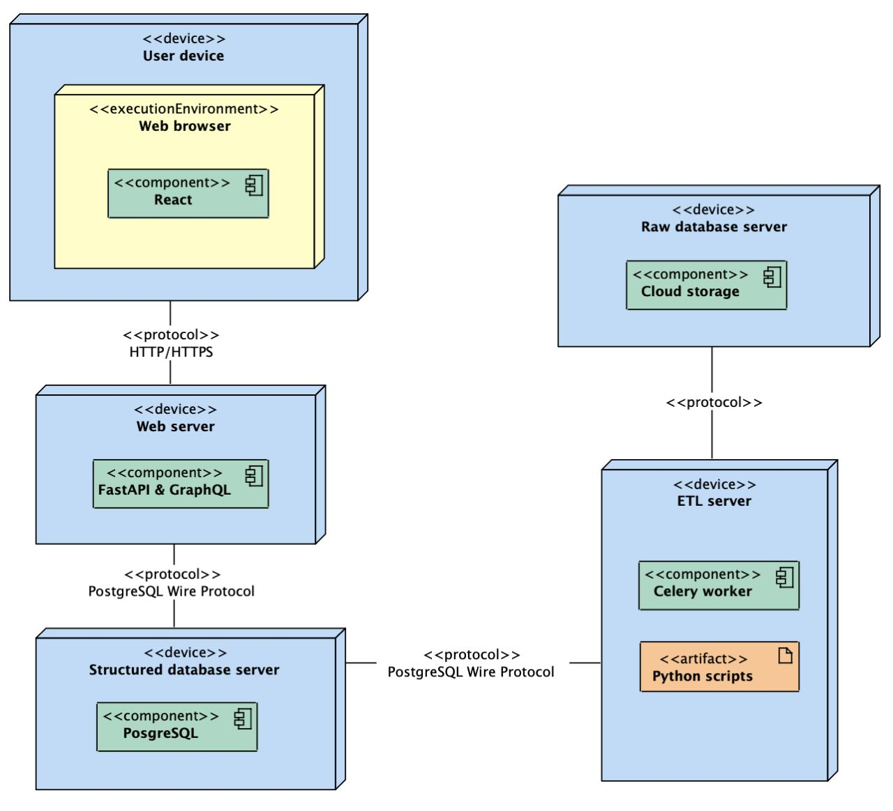

### Обновленная архитектура:

1. **Узел "User device" (Устройство пользователя)**:
    - Разработан с использованием React, этот компонент является основным средством взаимодействия пользователей с вашим приложением.
    - Включает в себя динамические поисковые фильтры, предоставляющие возможность пользователю настраивать параметры поиска для просмотра космических данных.
    - Обладает функцией экспорта данных, которая позволяет пользователям сохранять результаты поиска в различных форматах, в том числе в JSON, для дальнейшего анализа или использования в других приложениях.

2. **Узел "Web server" (Веб-сервер)**:
    - Хостинг FastAPI с интеграцией Strawberry для GraphQL, отвечающий за обработку запросов пользователей.
    - Включает компонент GraphQL API для эффективного извлечения данных и компонент FastAPI для асинхронной обработки данных и парсинга.

3. **Узел "Structured database server" (Сервер структурированных баз данных)**:
    - Содержит PostgreSQL для хранения обработанных и структурированных данных, обеспечивающих быстрый доступ API.

4. **Узел "ETL server" (Сервер ETL-процессов)**:
    - Задачи обработки данных выполняются здесь с использованием Celery и Python скриптов.
    - Отвечает за автоматизацию процессов ETL (извлечение, трансформация и загрузка данных), преобразование сырых данных в структурированные форматы и их обновление.
    - Получает неструктурированные данные с "Raw database server", обрабатывает их и переносит в "Structured database server".

5. **Узел "Raw database server" (Сервер неструктурированных баз данных)**:
    - Хранилище для всех сырых и неструктурированных данных, полученных из различных источников, включая публичные данные и данные от партнерских обсерваторий.

Важно подчеркнуть следующее:
- Высокая степень автоматизации и эффективности обработки данных.
- Использование современных технологий и подходов, таких как асинхронная обработка и GraphQL для оптимизации работы с данными.
- Гибкая и масштабируемая архитектура, позволяющая легко добавлять новые источники данных и расширять функциональность системы.

